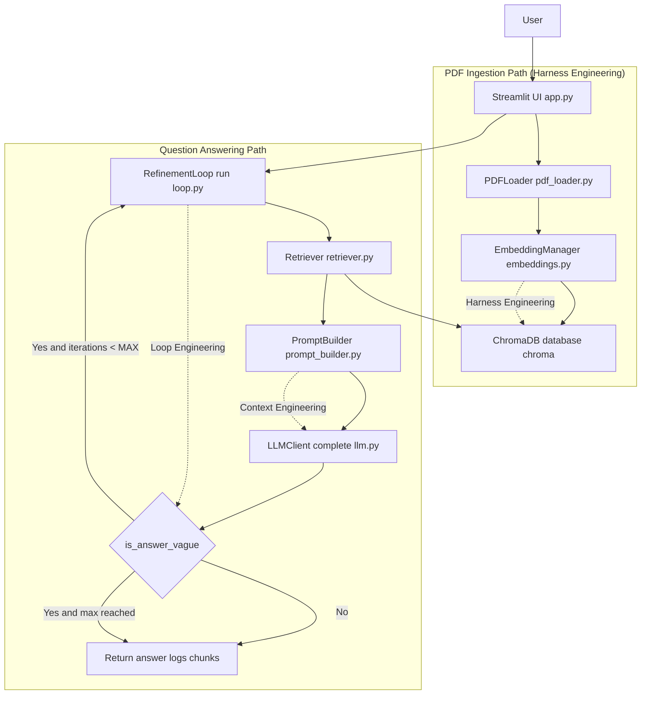

# Smart PDF Study Assistant

A beginner-friendly AI application that lets you upload lecture notes (PDF) and
ask questions about them.  Built to clearly demonstrate three core AI engineering
concepts: **Context Engineering**, **Harness Engineering**, and **Loop Engineering**.

---

## Architecture



### Data Flow

**PDF ingestion** (runs once per upload):
1. User uploads a PDF in `app.py`.
2. `PDFLoader.load_and_chunk()` extracts text and creates overlapping chunks.
3. `EmbeddingManager.add_chunks()` embeds each chunk and upserts into ChromaDB.

**Question answering** (runs on each question):
1. `RefinementLoop.run()` starts iteration 1.
2. `Retriever.retrieve()` gets `TOP_K_INITIAL` chunks (then `retrieve_excluding()` on later iterations).
3. `PromptBuilder.build()` assembles system prompt + trimmed history + chunks + question.
4. `LLMClient.complete()` generates an answer.
5. `_is_answer_vague()` checks quality:
   - if good, return immediately;
   - if vague and iterations remain, fetch new chunks and iterate;
   - if max reached, return the best available answer.

---

## Project Structure

```
study-assistant/
│
├── app.py                   # Streamlit UI — entry point
│
├── backend/
│   ├── __init__.py          # Makes backend/ a Python package
│   ├── config.py            # All settings, read from .env
│   ├── utils.py             # Logger factory + retry decorator
│   ├── pdf_loader.py        # PyMuPDF extraction + chunking
│   ├── embeddings.py        # OpenAI embeddings + ChromaDB writes
│   ├── retriever.py         # ChromaDB similarity search
│   ├── prompt_builder.py    # Assemble LLM prompt (Context Engineering)
│   ├── llm.py               # OpenAI chat completions wrapper
│   └── loop.py              # Iterative refinement loop
│
├── database/
│   └── chroma/              # ChromaDB persistent storage (auto-created)
│
├── uploads/                 # Saved PDF files (auto-created)
│
├── .env.example             # Copy to .env and add your API key
├── requirements.txt         # Python package list
├── environment.yml          # Conda environment spec
└── README.md                # This file
```

---

## Installation

### Prerequisites
- [Anaconda](https://www.anaconda.com/download) or Miniconda installed
- An [OpenAI API key](https://platform.openai.com/api-keys)

### Step 1 — Clone the repository
```bash
git clone <your-repo-url>
cd study-assistant
```

### Step 2 — Create and activate the Conda environment
```bash
conda env create -f environment.yml
conda activate study-ai
```

### Step 3 — Configure your API key
```bash
# Windows
copy .env.example .env

# macOS / Linux
cp .env.example .env
```

Open `.env` in any text editor and replace `sk-your-key-here` with your actual
OpenAI API key.

Alternatively, you can skip this step and enter the key directly in the
Streamlit sidebar when the app opens.

### Step 4 — Run the application
```bash
streamlit run app.py
```

The app will open automatically at `http://localhost:8501`.

---

## Usage

1. **Enter API key** — paste your OpenAI key in the sidebar (if not in `.env`).
2. **Upload PDF** — click "Choose a PDF file" and select your lecture notes.
3. **Process PDF** — click "Process PDF" and wait for the embedding step to finish.
4. **Ask questions** — type a question in the chat box at the bottom.
5. **Inspect the results** — expand "Loop status" and "Retrieved chunks" to see
   exactly how the answer was produced.

---

## Engineering Concepts Explained

### Context Engineering

> *Deciding what information enters the LLM's context window — and what stays out.*

A language model can only reason about what you put in front of it.  If you send
200 pages of lecture notes every time the user asks a question, you would:
- Spend hundreds of tokens on irrelevant material
- Exceed the model's context window on large documents
- Get worse answers (more "noise" dilutes the signal)

**Our solution:**
1. Break the PDF into small chunks (~500 words each)
2. Embed each chunk as a vector (a list of numbers encoding its meaning)
3. When the user asks a question, embed the question too
4. Retrieve only the 3–6 chunks whose vectors are closest to the question
5. Put *only those chunks* in the prompt alongside the question

The prompt always has exactly four layers:
```
[System prompt]          — sets the assistant's role and rules
[Last 3 exchanges]       — short-term memory, trimmed to save tokens
[Retrieved chunks]       — relevant passages from the PDF only
[Current question]       — what the user just asked
```

See `backend/prompt_builder.py` for the implementation.

---

### Harness Engineering

> *The infrastructure that wires all components together reliably.*

A harness is everything that is *not* the AI model itself — the plumbing that
makes the system work end-to-end without crashing:

| Component | File | What it handles |
|-----------|------|-----------------|
| Configuration | `config.py` | All settings in one place; secrets in `.env` |
| Logging | `utils.py` | Timestamped logs from every module |
| Retry | `utils.py` | Auto-retries OpenAI calls on transient failures |
| PDF I/O | `pdf_loader.py` | Save upload, extract text, chunk |
| Vector DB | `embeddings.py` | ChromaDB client, batch upsert, clear |
| LLM wrapper | `llm.py` | API call with retry + token logging |

If the OpenAI API returns a rate-limit error (HTTP 429), the `@retry` decorator
waits 2 seconds and tries again — up to 3 times — before giving up.  The rest of
the application never sees the error unless all retries are exhausted.

---

### Loop Engineering

> *Running a bounded cycle to iteratively improve output quality.*

A single retrieve-and-generate pass sometimes produces a vague answer, especially
when the most relevant information sits in chunks that were not in the top-3
results.  Loop Engineering adds a quality-check step:

```
Iteration 1:
  retrieve 3 chunks → build prompt → get answer → is it vague?
    No  → done ✅
    Yes →
Iteration 2:
  retrieve 3 MORE chunks (not yet seen) → bigger prompt → get answer → is it vague?
    No  → done ✅
    Yes →
Iteration 3 (final):
  retrieve 3 MORE chunks → biggest prompt → get answer → return regardless
```

**Vagueness heuristics** (in `backend/loop.py`):
- Answer is fewer than 80 characters
- Answer contains phrases like "not mentioned", "I don't know", "not provided"
- Answer shares fewer than 3 significant words with the retrieved chunks

This is *not* an autonomous agent.  The loop is:
- **Bounded** — at most 3 iterations
- **Transparent** — the UI shows exactly what happened in each pass
- **Cheap** — vagueness detection uses local string matching, not a second LLM call

---

## Screenshots

*(Replace these placeholders with actual screenshots after running the app.)*

| Upload & Process | Q&A with Loop Status |
|-----------------|---------------------|
| `screenshots/upload.png` | `screenshots/chat.png` |

---

## Configuration Reference

All settings live in `.env` (copy from `.env.example`):

| Variable | Default | Description |
|----------|---------|-------------|
| `OPENAI_API_KEY` | *(required)* | Your OpenAI secret key |
| `CHAT_MODEL` | `gpt-5.4-mini` | Model for generating answers |
| `EMBEDDING_MODEL` | `text-embedding-3-small` | Model for creating vectors |
| `CHUNK_SIZE` | `500` | Words per PDF chunk |
| `CHUNK_OVERLAP` | `50` | Words shared between adjacent chunks |
| `TOP_K_INITIAL` | `3` | Chunks retrieved on iteration 1 |
| `TOP_K_EXTRA` | `3` | Extra chunks on each subsequent iteration |
| `MAX_LOOP_ITERATIONS` | `3` | Maximum refinement iterations |
| `MAX_HISTORY_EXCHANGES` | `3` | Past Q&A pairs kept in prompt |
| `TEMPERATURE` | `0.2` | LLM randomness (0 = deterministic) |
| `MAX_TOKENS` | `1024` | Maximum reply length in tokens |
| `MAX_RETRIES` | `3` | API call retry attempts |
| `LOG_LEVEL` | `INFO` | Logging verbosity |

---

## Future Improvements

- **OCR support** — handle scanned (image-only) PDFs with Tesseract or AWS Textract
- **Multi-PDF sessions** — maintain separate collections per uploaded file
- **LLM-based answer evaluation** — replace heuristic vagueness check with a
  small grader model call (more accurate, higher cost)
- **Streaming responses** — use OpenAI's streaming API to show the answer word-by-word
- **FastAPI REST endpoints** — expose the backend as a proper API for mobile apps
- **Source highlighting** — show which sentence in the PDF each chunk came from
- **Export conversation** — download the Q&A session as a PDF study guide

---

## Troubleshooting

**"OpenAI API key is missing"**
→ Make sure you either filled in `.env` or entered the key in the sidebar.

**"No extractable text found in PDF"**
→ Your PDF is likely a scanned image.  OCR support is not included in this version.

**"ChromaDB collection is empty"**
→ You need to upload and process a PDF before asking questions.

**Slow first response**
→ The first question embeds the query and loads ChromaDB.  Subsequent questions
are faster because the client is cached.

---

## License

MIT — free to use, modify, and distribute for educational purposes.
